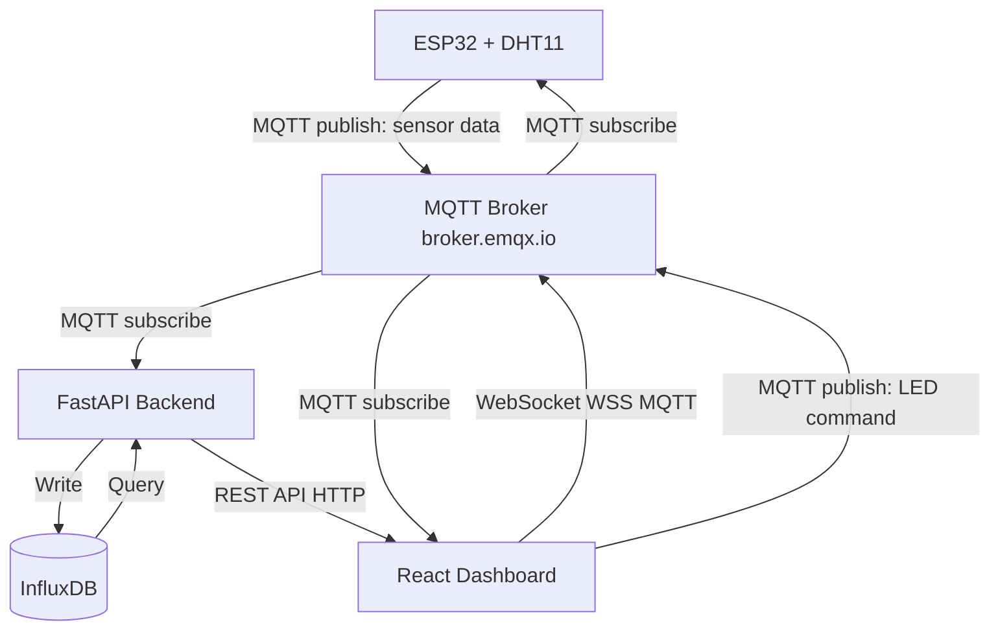
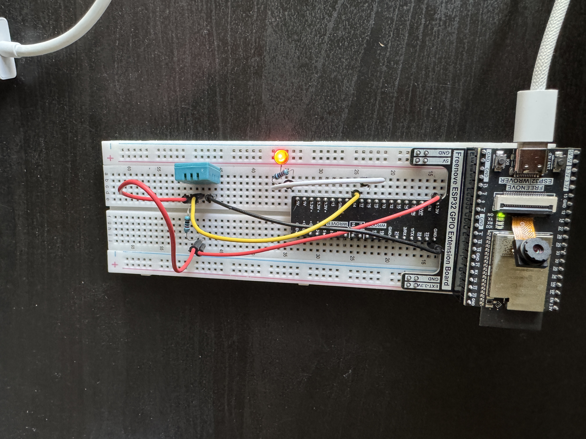
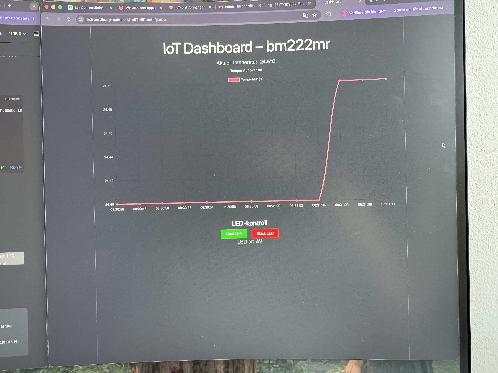

# IoT Assignment – bm222mr

## 1. Project Links

- **Live Dashboard:** https://extraordinary-salmiakki-c02e59.netlify.app/
- **Backend API:** https://fastapi-production-959b.up.railway.app/api/data
- **Repository:** https://gitlab.lnu.se/1dv027/student/bm222mr/assignment-iot

## 2. Project Overview

This project is an end-to-end IoT pipeline that monitors room temperature using a physical ESP32 microcontroller with a DHT11 temperature sensor. The device publishes sensor data every 2 seconds via MQTT to a public broker. A FastAPI backend subscribes to the MQTT topic, stores the data in InfluxDB, and exposes a REST API for historical data. A React dashboard visualizes both real-time and historical temperature data, and allows the user to toggle an LED on the ESP32 via MQTT commands.

**Hardware:**
- Freenove ESP32 Dev Board
- DHT11 temperature sensor
- Red LED with resistor

**Dashboard features:**
- Real-time temperature chart
- Historical data on load
- LED on/off control

## 3. Architecture and Data Flow



**Data flow:**
1. ESP32 reads temperature from DHT11 every 2 seconds
2. ESP32 publishes JSON to `lnu/iot/bm222mr/sensor` via MQTT
3. FastAPI backend subscribes to the topic and stores data in InfluxDB
4. React dashboard fetches historical data from `GET /api/data` on load
5. React dashboard subscribes to MQTT via WebSocket for real-time updates
6. User toggles LED from dashboard → publishes to `lnu/iot/bm222mr/command/led`
7. ESP32 receives command and toggles LED





## 4. Database Strategy

**Database:** InfluxDB 2.7 (hosted on Railway)

**Data model:**
- Measurement: `temperature`
- Tag: `student` = `bm222mr`
- Field: `value` (float) – temperature in Celsius
- Timestamp: server time in nanoseconds

**Time-series considerations:**
- Data is ingested every 2 seconds
- Dashboard queries last 30 minutes by default
- InfluxDB is optimized for time-series data with built-in retention policies

## 5. MQTT Topics and Payload Documentation

**Sensor data (published by ESP32):**
- Topic: `lnu/iot/bm222mr/sensor`
- Payload:
```json
{
  "value": 24.5,
  "timestamp": 0
}
```

**LED command (published by dashboard):**
- Topic: `lnu/iot/bm222mr/command/led`
- Payload:
```json
{
  "state": true
}
```
 

## 6. Reflection

**1. Which frontend technologies did you choose, and why?**

React was chosen because it was already familiar from previous course assignments. Chart.js with react-chartjs-2 was used for visualization due to its simplicity and flexibility. mqtt.js was used for WebSocket-based MQTT communication in the browser.

**2. How does handling real-time MQTT data over WebSockets differ from a standard REST API workflow?**

With REST, the client polls the server for new data at intervals. With MQTT over WebSockets, the connection is persistent and the server pushes new data to the client as soon as it arrives. This makes MQTT more efficient for real-time IoT data since there is no unnecessary polling.

**3. What was the most challenging integration step, and how did you solve it?**

The most challenging part was getting the physical ESP32 to work with the DHT11 sensor. Initially the wrong sensor type (DHT22) and wrong GPIO pin were configured, causing invalid readings. This was solved by switching to DHT11 and testing different GPIO pins until the sensor responded correctly. Deploying the backend to Railway and connecting it to InfluxDB also required careful configuration of environment variables and internal networking.